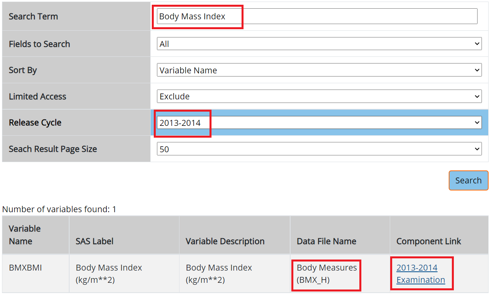
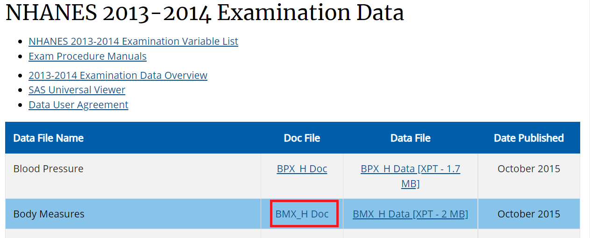
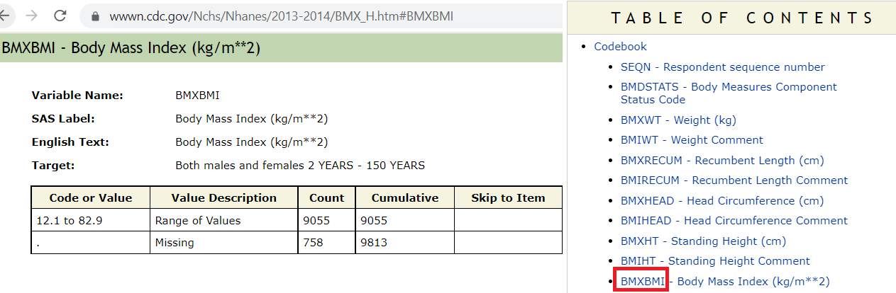

# Reproducing Results

## Reproduce results from a JAMA article

### Article

Let us use the article by @flegal2016trends as our reference. [DOI:10.1001/jama.2016.6458](https://jamanetwork.com/journals/jama/fullarticle/2526639), or [UBC access](https://libkey.io/10.1001/jama.2016.6458). 

### Task

Our task here is to reproduce the numbers reported in Table 1 from this article. 

### Eligibility criteria

Methods section from this article says:

- "For adults aged 20 years or older, obesity was defined according to clinical guidelines."
- "Pregnant women were excluded from analysis."
- "Participant age was grouped into categories of 20 to 39 years, 40 to 59 years, and 60 years and older."
- Table 1 title says NHANES 2013-2014 was used.

### Variables of interest

Variables of interest:

- `age` (eligibility and stratifying variable)
- `sex` (stratifying variable)
- `race` (stratifying variable)
- `pregnancy status` (eligibility)
- `obesity/BMI status` (main variable of interest for the paper)

### Searching for necessary variables

Search these variables using the NHANES variable keyword search within the 2013-14 cycle: [cdc.gov/nchs/nhanes/search/](https://wwwn.cdc.gov/nchs/nhanes/search/default.aspx)

- Below is an example for BMI variable search:

```{r jamabmi, echo=FALSE, out.width = '80%'}

```

- Identifying the component: Note that H is the index for 2013-14 cycle as seen in the picture:

```{r jamabmi2, echo=FALSE, out.width = '80%'}

```

- Identifying the variable:

```{r jamabmi3, echo=FALSE, out.width = '80%'}

```

- Rest of the variables all coming from demographic component

```{r jamademo, echo=FALSE, out.width = '80%'}
knitr::include_graphics("images/demo.png")
```

## Downloading relevant variables

### Demographic data

We are using same H index for demographic.

```{r search1, cache=TRUE}
library(nhanesA)
demo13 <- nhanes('DEMO_H')
Demo13 <- nhanesTranslate('DEMO_H', names(demo13), data=demo13)
```

### Examination data 

We are using same H index for BMI.

```{r search2, cache=TRUE}
exam13 <- nhanes('BMX_H')
Exam13 <- nhanesTranslate('BMX_H', names(exam13), data=exam13)
```

See all the column names in the data

```{r head}
names(Demo13)
names(Exam13)
```

## Retain only useful variables

```{r subset}
demo13select <- Demo13[c("SEQN", # Respondent sequence number
                         "RIDEXPRG", # Pregnancy status at exam
                         "RIAGENDR", # Gender
                         "RIDAGEYR", # Age in years at screening
                         "RIDRETH3")]  # Race/Hispanic origin w/ NH Asian
exam13select <- Exam13[c("SEQN", # Respondent sequence number
                         "BMXBMI")] # Body Mass Index (kg/m**2)
```

### Quick pick at the data 

```{r head2}
head(demo13select)
head(exam13select)
```

## Merge dara

Use the ID variable `SEQN` to merge both data:

```{r merge}
merged.data <- merge(demo13select, exam13select, 
                     by = c("SEQN"), all=TRUE)
head(merged.data)
dim(merged.data)
merged.data$SEQN <- NULL
```

### Investigate merged data

Missing data available?

```{r table}
require(tableone)
tab_nhanes <- CreateTableOne(data=merged.data,
                             includeNA = TRUE)
print(tab_nhanes, 
      showAllLevels = TRUE)
summary(merged.data$BMXBMI)
```


## Applying eligibility criteria

We subset the data using criteria similar to the JAMA paper by @flegal2016trends (see above)

```{r analytic0}
analytic.data1 <- subset(merged.data, !is.na(BMXBMI)) # no missing BMI
dim(analytic.data1)
analytic.data2 <- subset(analytic.data1, RIDAGEYR >= 20) # Age >= 20
dim(analytic.data2)
table(analytic.data2$RIDEXPRG,useNA = "always")
analytic.data3 <- subset(analytic.data2,  # Pregnant women excluded
                         is.na(RIDEXPRG) | RIDEXPRG != 
                           "Yes, positive lab pregnancy test")
dim(analytic.data3)
```

## Recoding variables

Recode similar to the JAMA paper by @flegal2016trends (see above)

```{r analytic1}
analytic.data3$AgeCat<-cut(analytic.data3$RIDAGEYR, 
                           c(0,20,40,60,Inf), 
                           right = FALSE)
analytic.data3$Gender <- car::recode(analytic.data3$RIAGENDR, 
                                "'1'='Male'; 
                                '2'='Female'")
table(analytic.data3$Gender,useNA = "always")
analytic.data3$Race <- car::recode(analytic.data3$RIDRETH3,
                                "c('Mexican American',
                                'Other Hispanic')='Hispanic';
                                'Non-Hispanic White'='White';
                                'Non-Hispanic Black'='Black';
                                'Non-Hispanic Asian'='Asian';
                                else=NA")
analytic.data3$Race <- factor(analytic.data3$Race, 
                              levels = c('White', 
                                         'Black', 
                                         'Asian', 
                                         'Hispanic'))
```

## Reproducing Table 1

Compare with Table 1

```{r analytic2}
with(analytic.data3, table(AgeCat,Gender))
apply(with(analytic.data3, table(AgeCat,Gender)),1,sum)
with(analytic.data3, table(AgeCat,Race))
analytic.data3m <- subset(analytic.data3, 
                          Gender == "Male")
with(analytic.data3m, table(AgeCat,Race))
analytic.data3f <- subset(analytic.data3, 
                          Gender == "Female")
with(analytic.data3f, table(AgeCat,Race))
```

Also see @ds for a tidyverse solution.

