--- 
title: "Survey Data Analysis"
author: "Ehsan Karim"
date: "`r Sys.Date()`"
knit: "bookdown::preview_chapter"
site: "bookdown::bookdown_site"
link-citations: yes
output:
  bookdown::gitbook: 
    highlight: tango
    split_by: chapter
    split_bib: no
  bookdown::html_book:
    theme: simplex  
  msmbstyle::msmb_html_book:
    highlight: tango
    toc: TRUE
    toc_depth: 1
    split_by: chapter
    split_bib: no
    margin_references: FALSE
documentclass: book
bibliography: [book.bib]
biblio-style: apalike
github-repo: ehsanx/504007-SurveyData
description: "This second level course will teach research trainees to apply methods taught in prior courses towards the development of a fundable research protocol and the analysis and interpretation of real epidemiologic data."
---


```{r setup2, include=FALSE}
library(tufte)
library(msmbstyle)
knitr::opts_chunk$set(tidy = FALSE, cache.extra = packageVersion('msmbstyle'))
options(htmltools.dir.version = FALSE)
options(knitr.duplicate.label = "allow")
```


# About this Text

This is the 3rd run of this rather newly developed course. The purpose of this course is to provide students with learning opportunities to understand fundamental epidemiological concepts through the application of methods using population and public health datasets. The purpose is also to introduce students to emerging epidemiological methodologies that are frequently being applied to population and public health-related research questions in prestigious epidemiology journal publications.

<!--chapter:end:index.Rmd-->

# Model-based Approach {#tab-3}

Review of regression analysis and ANOVA from pre-requisites (+ some extra concepts). Below we see an example of a random data generating process that depends on specification of a probability model. We assume that the population data was generated from a `Normal distribution`, and we are merely dealing with a sample. All our inferences (point estimate or hypothesis testing) will depend on how closely the data fulfill such assumption.  We call such approach as '`model-based`' approach.

```{r setup3, include=FALSE}
# require(hms)
# require(reshape2) 
require(car)
```

## Example

Does plant weight increase with added nutrition? 

The following problem was taken from Exercise set 2.5 (2.1) from  @dobson2008gml:

> "Genetically similar seeds are randomly assigned to be raised in either a nutritionally enriched environment (treatment group) or standard conditions (control group) using a completely randomized experimental design. After a predetermined time all plants are harvested, dried and weighed."

## Research question

We want to test whether there is any difference in yield (weight) between the two groups 

  * plants from nutritionally enriched environment (treatment group) and 
  * plants from standard conditions (control group)

### Notations

1. Let $k$ be the index of each plant, and $k = 1,...,20$ for both groups.
2. Let $j$ be the index for groups. Here, $j = 1$ for the treatment group (`Trt`), $j = 2$ for the control group (`Ctl`).
3. Let $Y_{jk}$ denote the $k$th observation of weights in the $j$th group.  

### Assumptions

1. Assume that the $Y_{jk}$'s are independent random variables with $Y_{jk} \sim N(\mu_j , \sigma^2)$. 
2. We also assume that the variances are homogenious, that is, ${\sigma_1}^2$ and ${\sigma_2}^2$ are not very different (and could be pooled to one single value of $\sigma^2$). 

### Hypothesis

The null hypothesis $H_0 : \mu_1 = \mu_2 = \mu$, that there is no difference, is to be compared with the alternative hypothesis $H_1 : \mu_1 \ne \mu_2$. 

## Data

### Data table

```{r rawData, echo=TRUE}
ctl <- c(4.17,5.58,5.18,6.11,4.50,4.61,5.17,4.53,5.33,5.14)
trt <- c(4.81,4.17,4.41,3.59,5.87,3.83,6.03,4.89,4.32,4.69)
length(ctl);length(trt)
group <- rep(c("Ctl","Trt"), each = length(ctl))
group
mode(group)
weight <- c(ctl, trt)
weight
mode(weight)
Plant.Weight.Data <- data.frame(group=group, weight = c(ctl, trt)) 
mode(Plant.Weight.Data)
dim(Plant.Weight.Data)
str(Plant.Weight.Data)
```

The results, expressed in grams, for 20 plants in each group are shown in the following Table.

```{r rawDataShow, echo=TRUE}
library(DT)
datatable(Plant.Weight.Data)
```

### Visualization

```{r rawDataShow2, echo=TRUE}
boxplot(weight~ group,data=Plant.Weight.Data)
weight.means <- aggregate(weight ~  group, data=Plant.Weight.Data, FUN=mean)
weight.means
weight.medians <- aggregate(weight ~  group, data=Plant.Weight.Data, FUN=median)
weight.medians
points(1:2, weight.means$weight, pch = "*", col = "blue")
text(c(1:2)+0.25, weight.means$weight, labels = 
       paste("Mean = ", weight.means$weight), col = "blue")
text(c(1:2)-0.25, weight.means$weight, labels = 
       paste("Median = ",weight.medians$weight), col = "black")
```

Wait: so, plan weight reduces as we add nutrition? How confidently can we say that this added nutrition harmful for the plants (e.g., so that the weight will be reduced)?

## Checking assumptions

Test of normality of the outcomes (Shapiro-Wilk normality test):
```{r testing1, echo=TRUE}
shapiro.test(Plant.Weight.Data$weight)
```
Therefore, we cannot reject the null hypothesis that samples come from a population which has a normal distribution. Also check a normal quantile-quantile plot:
```{r testing11, echo=TRUE}
qqnorm(Plant.Weight.Data$weight)
qqline(Plant.Weight.Data$weight)
```

Test of homogeneity of variances, that tests $H_0 : \sigma_1 = \sigma_2$ vs. $H_1 : \sigma_1 \ne \sigma_2$: 
```{r testing2, echo=TRUE}
# SD from each groups
tapply(Plant.Weight.Data$weight, 
       INDEX = Plant.Weight.Data$group, FUN = sd)
bartlett.test(weight ~ group, data = Plant.Weight.Data) # Bartlett's test
# leveneTest(weight ~ group, data = Plant.Weight.Data) # Levene's test
```

## Analysis

### Two-sample t-test

A two-sample (independent) t-test compares the weights of control and treatment group as follows (assuming equal variance; judging from the IQR from the boxplots or the above Bartlett test):
```{r simpleAnalysis0, echo=TRUE}
ttest<- t.test(weight ~ group, data = Plant.Weight.Data, 
               paired = FALSE, var.equal = TRUE)
ttest
```
Here, we test $H_0 : \mu_1 = \mu_2 = \mu$ vs. $H_1 : \mu_1 \ne \mu_2$. 
```{r simpleAnalysis011, echo=TRUE}
ttest$statistic
```

### Regression

A simple linear model exploring the relationship between the plant weight and the group status can be fitted as follows: 
```{r simpleAnalysis, echo=TRUE}
lm.group.including.intercept <- lm(weight ~ 1 + group, data = Plant.Weight.Data)
lm.group.including.intercept
lm.group <- lm(weight ~ group, data = Plant.Weight.Data)
lm.group
confint(lm.group)
```

#### Interpretation
Note that the variable `group` is dummy coded. `R` generally chooses the first category as the reference category.
```{r simpleAnalysis118, echo=TRUE}
levels(Plant.Weight.Data$group)
```

  1. In this case, the intercept `r coef(lm.group)[1]` tells us the predicted mean value for the plant weights for the control group (reference category of the group variable). 
  2. On the other hand, the slope in interpreted as the expected difference in the mean of the plant weights for that treatment group as compared to the control group. On average, weight is `r abs(coef(lm.group)[2])` units (lb?) lower in plants who are in the treatment condition compared to those in the control condition.

#### Summary of the regression fit
The complete summary of the results is as follows:
```{r simpleAnalysisX, echo=TRUE}
summary(lm.group)
```
This is testing a different hypothesis (from the table): $H_0: \alpha = 0$ vs. $H_1: \alpha \ne 0$ ($\alpha$ being the intercept) and $H_0: \beta = 0$ vs. $H_1: \beta \ne 0$ ($\beta$ being the slope). At the bottom of the `summary` output, the `F-statistic` tests $H_0: \beta = 0$ vs. $H_1: \beta \ne 0$. This is an overall, and could accomodate more slopes if the regression had more slopes. E.g., for 2 slopes, this would have tested $H_0: \beta_1 = \beta_2 = 0$.

#### Regression plot
Let us visualize the scatter plot and the regression line:
```{r simpleAnalysisplot, echo=TRUE}
Plant.Weight.Data$group.code <- 
  ifelse(Plant.Weight.Data$group == "Trt", 1, 0)
Plant.Weight.Data$group.code
lm.code <- lm(weight ~ group.code, data = Plant.Weight.Data)
plot(weight ~ group.code, data = Plant.Weight.Data, 
     axes = FALSE, xlab = "Groups")
axis(1, 0:1, levels(Plant.Weight.Data$group))
axis(2)
abline(lm.code, col = "blue") # regression line
abline(h=coef(lm.code)[1], col = "red") # intercept
```

#### Assumption checking for the residuals
Checking normality of the residuals:
```{r simpleAnalysis224, echo=TRUE}
lm.residual <- residuals(lm.group)
shapiro.test(lm.residual)
qqnorm(lm.residual)
qqline(lm.residual)
```

#### Null model
A null model (with only intercept):
```{r simpleAnalysis22, echo=TRUE}
lm.null <- lm(weight ~ 1, data = Plant.Weight.Data) # Including just the intercept
summary(lm.null)
```

### ANOVA

For testing for the significance of the group membership, we can compare the current model to the null model (is adding the variable `group` in the model useful?). 
```{r simpleAnalysis1, echo=TRUE}
anova(lm.null,lm.group)
```

Or, we could directly test $H_0 : \mu_1 = \mu_2 = \mu$ vs. $H_1 : \mu_1 \ne \mu_2$ under the homogeneity of variances assumption: 
```{r simpleAnalysis12, echo=TRUE}
anova(lm.group)
# Alternate ways to do the same
# car::Anova(lm.group,type="II")
aov.fit <- aov(lm.group)
summary(aov.fit)
# Multiple pairwise-comparison: 
# (compare with t-test; same p-value?)
TukeyHSD(aov.fit) 
```

Checking normality of the residuals (not run; same as above):
```{r simpleAnalysis225, echo=TRUE}
# aov.residual <- residuals(aov.fit)
# shapiro.test(aov.residual)
# qqnorm(aov.residual)
# qqline(aov.residual)
```

ANOVA is basically a generalization of the two-sample t-test (verify that the calculated $F = t^2$):
```{r simpleAnalysis2, echo=TRUE}
ttest$statistic^2
```

An alternative non-parametric version of this independent 2-sample test is as follows (a Kruskal-Wallis rank sum test):
```{r simpleAnalysis111, echo=TRUE}
# Assuming groups come from similar shaped populations:
kruskal.test(weight ~ group, data = Plant.Weight.Data) 
```

## Verdict

### Informal conclusion
With added nutrition, plant weights generally decrease (judging from the point estimate), but such trend could be due to sampling fluctuation (e.g., as the 95% confidence interval includes the null value of 0) and we can not confidently (not at least with 95% confidence) say that adding nutrition will cause plant weights to go down.

### A word of caution
Note that, we are inherently trying to infer 'causality' out of a statistical analysis, even though our hypothesis is not about 'cause' explicitly. Unfortunately, correlation does not imply causation, and we need to know more about the subject-area and study-design before we make such inference or interpretation.

## Exercises (Optional)

1. What is the difference between a regression analysis with a dummy coded predictor variable vs. an ANOVA?
2. Was multiple pairwise-comparison (`TukeyHSD`) necessary in the above example?  
3. Which `R` package includes the `leveneTest` function? (hint: use `help.search()` function.)
4. Is 'multicollinearity' an issue in the above example?
5. In the current example, can we interpret the slope as follows: `the change in Y for a 1-unit change in X` where, $Y$ being the outcome and $X$ being the predictor? Why, or why not?


<!--chapter:end:review.Rmd-->

# Design-based Approach

```{r setup4, include=FALSE}
#require(diagram)
require(DiagrammeR)
require(DiagrammeRsvg)
require(rsvg)
library(magrittr)
library(svglite)
library(png)
use.saved.chche <- TRUE
```


```{r graph1, echo=FALSE, include = FALSE}
# names <- c("Statistical inference", "Design-based", "Model-based")
# M <- matrix(nrow = 3, ncol = 3, byrow = TRUE, data = 0)
# M[2, 1] <- M[3, 1] <- ""
# plotmat(M, pos = c(1, 2), curve = 0, name = names, lwd = 1,
#         box.lwd = 2, cex.txt = 0.8, box.type = "square", box.prop = 1.0)
```

Before discussing design-based approach, let us review some of concepts related to `sampling`. 

## Sampling

### Steps of generalization

```{r sampling0, echo=FALSE,cache=use.saved.chche}
sampling0 <- grViz("
	digraph causal {
	
	  # Nodes
	  node [shape = square]
    t [label = 'Target population']
    s [label = 'Sampling Frame']
    g [label = 'Active Frame']
    m [label = 'Sampling list']
    r [label = 'Actual sample']

	  # Edges
	  edge [color = black,
	        arrowhead = vee]
	  rankdir = LR
    t -> s -> g  -> m -> r
    r -> g
	  # Graph
	  graph [overlap = true, fontsize = 10]
	}")
sampling0 %>% export_svg %>% charToRaw %>% rsvg %>% png::writePNG("images/sampling0.png")
```

```{r sampling0x, echo=FALSE, out.width = '65%'}
knitr::include_graphics("images/sampling0.png")
```

Example: Let us consider CCHS.

- Target population
    - Canadian population 12 years of age and over
- Sampling Frame
    - Canadian population 12 years of age and over exluding about 3% population (e.g., aboriginal settlements, canadian Forces, institutionalized, foster care, 2 selected Quebec health regions)
- Active Frame
    - People that are still reachable e.g., not dead or have not moved
- Sampling list
    - Prepared from a specific sampling technique
- Actual sample
    - people that have responded

Note that, results from 'actual sample' can be generalized to the 'active frame'. Hence, an inference from a sample in not really generalizable to the target population (strictly speaking).


### Types of sampling techniques

```{r sampling1, echo=FALSE,cache=use.saved.chche}
sampling1 <- grViz("
	digraph causal {
	
	  # Nodes
	  node [shape = square]
    s [label = 'sampling']
    
    node [shape = circle]
    p [label = 'Probability,\n known non-zero\n probability of selection']
    n [label = 'Non-probability, \n probabilities of\n selection are\n not known'] 
	  
    node [shape = egg]
    srs [label = 'simple random,\n equal selection probability']
    str [label = 'stratified,\n population divided\n into heterogeneous\n groups']
    cluster [label = 'cluster,\n population divided\n into comparable\n groups']
    others [label = '(systematic) ...']
    complex [label = 'Complex survey, \n cluster + stratification']
    conv [label = 'convenience,\n  easy\n access']
    pur [label = 'purposive,\n  rare\n disease']
    quo [label = 'quota,\n  interviewers\n choose']
    other [label = '...']

	  # Edges
	  edge [color = black,
	        arrowhead = vee]
	  rankdir = LR
    s -> {p n}
    p -> {srs str cluster complex others} 
    n -> {conv pur quo other}

	  # Graph
	  graph [overlap = true, fontsize = 10]
	}")
sampling1 %>% export_svg %>% charToRaw %>% rsvg %>% png::writePNG("images/sampling1.png")
```

```{r sampling1x, echo=FALSE, out.width = '85%'}
knitr::include_graphics("images/sampling1.png")
```


## Statistical inference

### Model-based  
Most of the statistical techniques we have seen in our pre-requisite courses (`SPPH 400, 500`) generally assumed that we are dealing with a sample that was obtained from an infinite population. We usually assume that a random process can approximate such data generation process, and the data was collected by a simple random sampling or SRS (everyone has equal opportunity to be selected in the sample). All our conclusions are based on such assumptions. If we are wrong in specifying correct distribution to approximate the data generating process, our subsequent inferences may not be valid anymore. 

```{r graph2, echo=FALSE,cache=use.saved.chche}
design1 <- grViz("
	digraph causal {
	
	  # Nodes
	  node [shape = square]
    s [label = 'Statistical inference']
    
    node [shape = circle]
    m [label = 'model-based']
    d [label = 'design-based'] 
	  
    node [shape = egg]
    i [label = 'Infinite population:\n a reasonable distribution']
    f [label = 'Fixed and finite population:\n a large national survey']

    node [shape = plaintext]
    is [label = 'Random sample\n with equal probability,\n independent\n observations']
    if [label = 'Sample with\n known probability,\n observations may be\n dependent']

	  # Edges
	  edge [color = black,
	        arrowhead = vee]
	  rankdir = LR
    s -> {m d}
    m -> i 
    d -> f
    i -> is
    f -> if

	  # Graph
	  graph [overlap = true, fontsize = 10]
	}")
design1 %>% export_svg %>% charToRaw %>% rsvg %>% png::writePNG("images/design1.png")
```

```{r graph2x, echo=FALSE, out.width = '85%'}
knitr::include_graphics("images/design1.png")
```

### Design-based 

Generally, when wide-scale surveys are designed, simple random sampling or SRS may not be feasible for various practical considerations. May be researchers and policy-makers want that a special but small sub-group subjects should be included in our sample (e.g., people suffering from a rare disease), but it is possible that by a SRS scheme, none of the subject from that small subgroup will be included. For convenience of sampling, and for controlling variance, researchers may have to make desicions regarding how the survey needs to collect sample. Researchers may resort to cluster or stratified sampling; or a mix of both (trade-off between cost and precision). Unfortunately, in these cases, equal probability of being selected in the sample is not there any more. @lumley2011complex discussed the following properties for making design-based inference:

- properties needed to get valid estimates
    - non-zero probability ($P_i>0$ for subject i) of being selected in the sample
    - every subject has a known probability ($P_i$) of being seleted
- properties needed to acieve accuracy of those estimates
    - Every pair of subjects must have a non-zero probability ($P_{ij}>0$ for subjects i and j) of being selected in the sample and
    - that probability ($P_{ij}$) must be known as well.
    
## Complex surveys

### Design features    

```{r graph3, echo=FALSE,cache=use.saved.chche}
design2 <- grViz("
	digraph causal {
	
	  # Nodes
	  node [shape = egg]
    cs [label = 'Complex surveys']
    
    node [shape = circle]
    c [label = 'Clustering']
    s [label = 'Stratification'] 
    w [label = 'Weighting'] 
	  
	  # Edges
	  edge [color = black,
	        arrowhead = vee]
	  rankdir = LR
    cs -> {c s w}

	  # Graph
	  graph [overlap = true, fontsize = 10]
	}")
design2 %>% export_svg %>% charToRaw %>% rsvg %>% png::writePNG("images/design2.png")
```

```{r graph3x, echo=FALSE, out.width = '45%'}
knitr::include_graphics("images/design2.png")
```

#### Stratification

Considering sub-groups that are sufficiently different from each other with respect to characteristics. Usual examples:

- different geographical location
- income
- gender

For each stratum (single unit), sampling is done separately. As we can select sample size from each stratum, we are able to control for variability of the estimates (`SE`) from each strata as well.

#### Clustering

Clustering is done for convenience of data collection, generally. In a nationwide survey, researchers may choose to collect more samples from selected geographic locations. This is generally the case for cost considerations. In doing so, the surveyers don't have to travel too far, as they could essentially get many neighboring subjects at a much lower cost. An obvious consequence could be that the neighboring subjects may be more correlated with each other compared to subjects who are selected by randomness. This may cause the observations not being independent anymore.

#### Weighting

Assume that, in a SRS, a subject is selected in a sample with a probability of $p_i = 0.04$. This mean, that person is representing $(1/p_i) = (1/0.04) = 25$ subjects in the population. We call this the `sampling weight` ($w_i = 25$). There are other type of weight:

- `precision weight`
- `frequency weight`

but we are not really interested about those in this course in general.

In a complex survey, where we have stratification and clustering, this weight is not as straight-forward becasue, then, it is coming from an unequal probability sampling. As a consequence, not all subjects in the population will have the same probability $(p_i)$ of being included in the sample, and the sampling weights ($w_i$) will vary as well (but the probability or weight is known for each subjects).

### Design effect

Compared to a SRS, all of the design features of a complex survey, such as, stratification, cluster sampling, and weighting generally influence the SEs of the estimates. Survey researchers use a ratio called design effect, to account for the difference in SEs between a complex survey versus a SRS:

$DE^2 = \frac{SE^2_{Complex.Survey}}{SE^2_{SRS}}$.

## Further readings

Available via UBC library:

- Chapter 2 of @heeringa2017applied
- Chapter 1 of @lumley2011complex
- Section 6.3 of @bilder2014analysis
- Chapter 12 of @vittinghoff2011regression

## Exercise

- Skim through the first chapter (from the further readings list). Should be easier to read most of it after this lecture.
- If any terminology remains unfamiliar, please discuss on Canvas.


<!--chapter:end:designBased.Rmd-->

# Importing CCHS to R

This is a short instruction document of how to get CCHS dataset from the UBC library site to your RStudio environment. Once we bring the dataset into RStudio, the next step is to think about creating analytic dataset.

## Downloading CCHS data from UBC

* **Step 1**: Go to [dvn.library.ubc.ca](http://dvn.library.ubc.ca), and press 'log-in'

```{r ubc1, echo=FALSE, out.width = '65%'}

```

* **Step 2**: Select 'UBC' from the dropdown menu

```{r ubc2, echo=FALSE, out.width = '65%'}

```

* **Step 3**: Enter your CWL or UBC library authentication information

```{r ubc3, echo=FALSE, out.width = '65%'}
knitr::include_graphics("images/abacus3.png")
```

* **Step 4**: Once you log-in, search the term 'cchs' in the search-box

```{r ubc4, echo=FALSE, out.width = '65%'}

```

* **Step 5**: For illustrative purposes, let us work with the Cycle 3.1 of the CCHS dataset from the list of results

```{r ubc5, echo=FALSE, out.width = '65%'}

```

* **Step 6**: CCHS Cycle 3.1 information

```{r ubc6, echo=FALSE, out.width = '65%'}
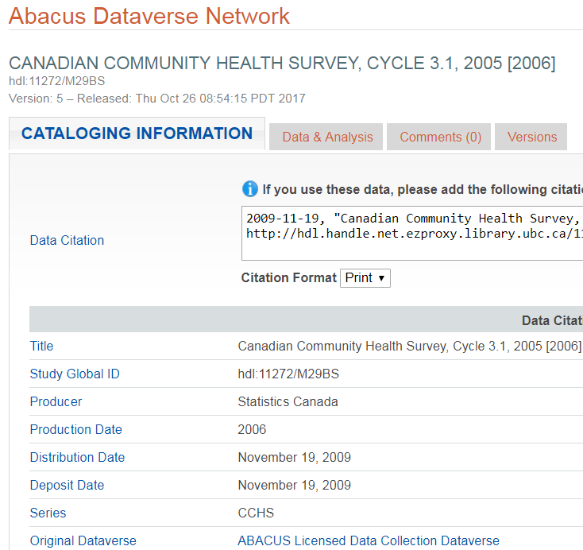
```

* **Step 7**: Choose the 'Data and Analysis' tab

```{r ubc7, echo=FALSE, out.width = '65%'}
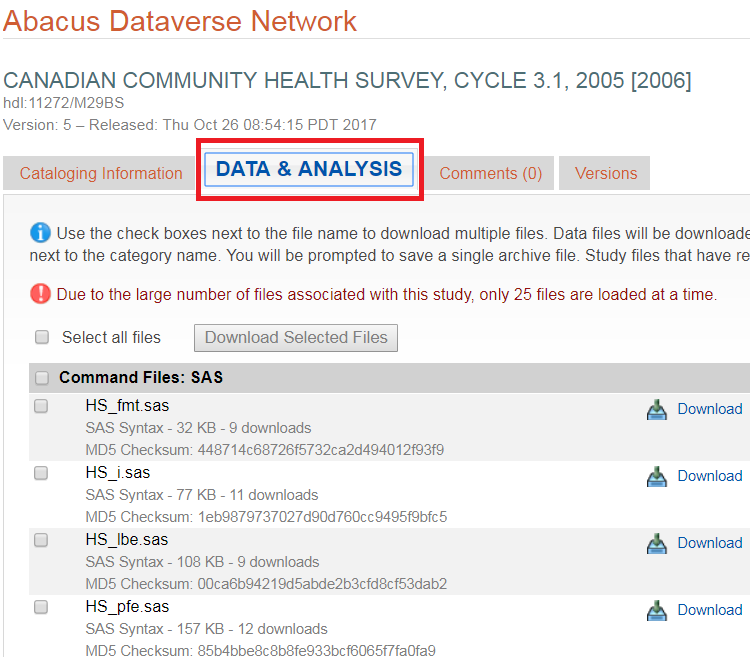
```

* **Step 8**: Download the entire data (about 159 MB) as a zip file

```{r ubc8, echo=FALSE, out.width = '65%'}
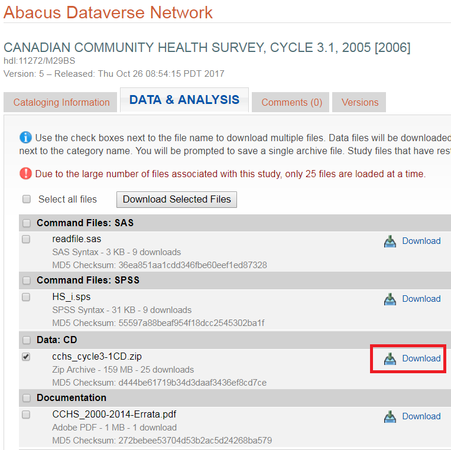
```

* **Step 9**: Accept the 'terms of use'

```{r ubc9, echo=FALSE, out.width = '65%'}
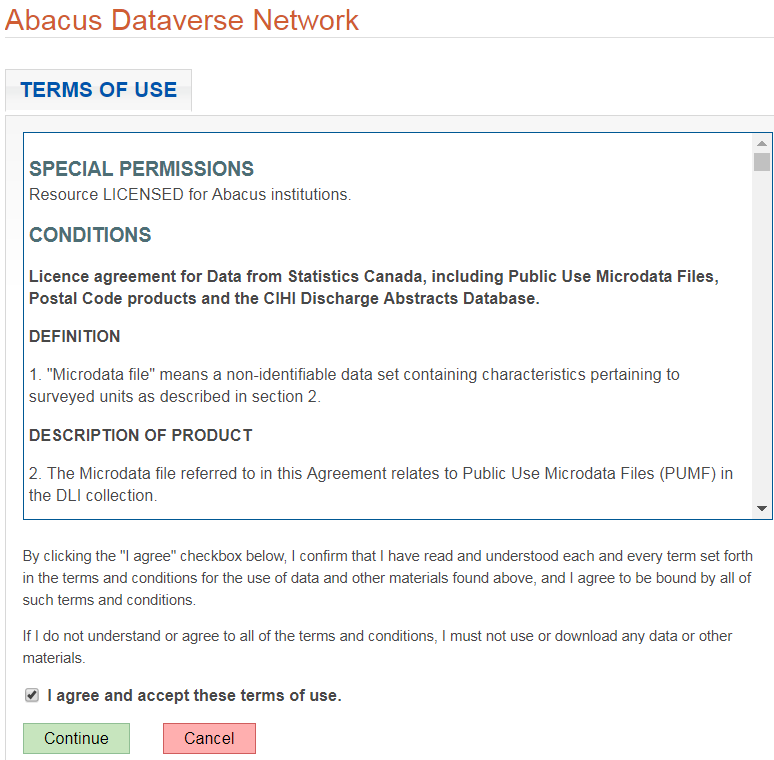
```

* **Step 10**: Select a directory to download the zip file

```{r ubc10, echo=FALSE, out.width = '65%'}

```

* **Step 11**: Extract the zip file

```{r ubc11, echo=FALSE, out.width = '65%'}
knitr::include_graphics("images/abacus11.png")
```

* **Step 12**: Be patient with the extraction

```{r ubc12, echo=FALSE, out.width = '65%'}
knitr::include_graphics("images/abacus12.png")
```

* **Step 13**: Once extraction is complete, take a look at the folders inside. You will see that there is a folder named 'SAS_SPSS'

```{r ubc13, echo=FALSE, out.width = '65%'}
knitr::include_graphics("images/abacus13.png")
```

## Reading and Formatting the data 
### Option 1: Processing data using SAS
SAS is a commercial software. You may be able to get access to educational version. In case you don't have access to it, later we outline how to use free packages to read these datasets.

* **Step 1**: Inside that 'SAS_SPSS' folder, find the file *hs_pfe.sas*. It is a long file, but we are going to work on part of it. First thing we want to do it to change all the directory names to where you have unzipped the downloaded file (for example, here the zip file was extracted to C:/CCHS/Data/cchs_cycle3-1CD/). We only need the first part of the code (as shown below; only related to data 'hs'). Delete the rest of the codes for now. The resulting code should like like this:
```{r eval=FALSE}
%include "C:\CCHS\Data\cchs_cycle3-1CD\SAS_SPSS\Layouts\hs\hs_pfe.sas";

data hs;
        %let datafid="C:\CCHS\Data\cchs_cycle3-1CD\Data\hs.txt";
		%include "C:\CCHS\Data\cchs_cycle3-1CD\SAS_SPSS\Layouts\hs\hs_i.sas";
        %include "C:\CCHS\Data\cchs_cycle3-1CD\SAS_SPSS\Layouts\hs\hs_fmt.sas";
        %include "C:\CCHS\Data\cchs_cycle3-1CD\SAS_SPSS\Layouts\hs\hs_lbe.sas";
run;
```
Once the modifications are done, submit the codes in SAS. Note that, the name of the data is 'hs'.

```{r ubc14, echo=FALSE, out.width = '65%'}
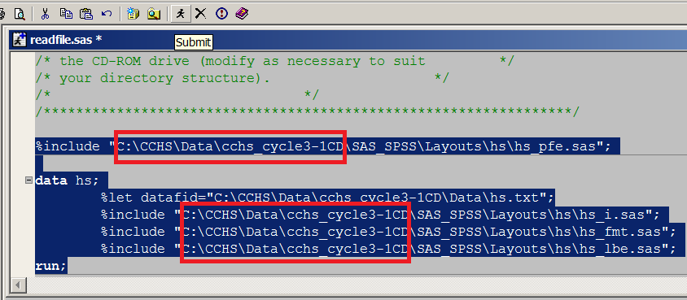
```

* **Step 2**: Once you submit the code, you can check the log window in SAS to see how the code submission went. It should tell you how many observations and variables were read.

```{r ubc15, echo=FALSE, out.width = '65%'}
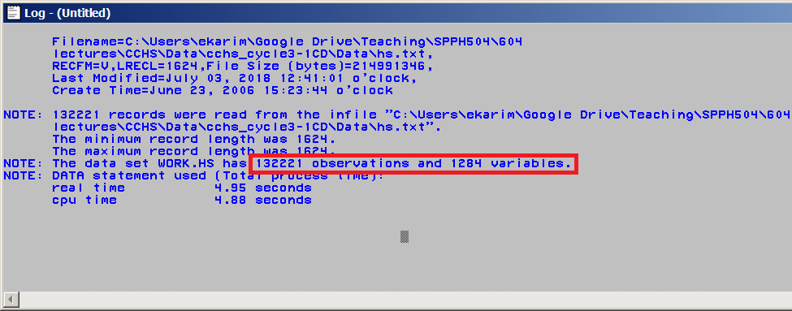
```

* **Step 3**: If you one to view the dataset, you can go to 'Explorer' window within SAS.

```{r ubc16, echo=FALSE, out.width = '65%'}
knitr::include_graphics("images/abacus16.png")
```

* **Step 4**: Generally, if you haven't specified where to load the files, SAS will by default save the data into a library called 'Work'

```{r ubc17, echo=FALSE, out.width = '65%'}
knitr::include_graphics("images/abacus17.png")
```

* **Step 5**: Open that folder, and you will be able to find the dataset 'Hs'.

```{r ubc18, echo=FALSE, out.width = '65%'}
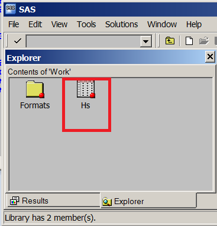
```

* **Step 6**: Right click on the data, and click 'open' to view the datafile.

```{r ubc19, echo=FALSE, out.width = '65%'}
knitr::include_graphics("images/abacus19.png")
```

* **Step 7**: To export the data into a CSV format data (so that we can read this data into other software packages), ckick 'Menu'.

```{r ubc20, echo=FALSE, out.width = '65%'}
knitr::include_graphics("images/abacus20.png")
```

* **Step 8**: then press 'Export Data'.

```{r ubc21, echo=FALSE, out.width = '65%'}
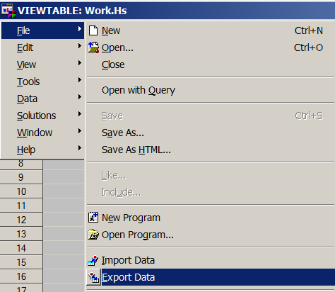
```

* **Step 9**: choose the library and the data.

```{r ubc22, echo=FALSE, out.width = '65%'}
knitr::include_graphics("images/abacus22.png")
```

* **Step 10**: choose the format in which you may want to save the existing data.

```{r ubc23, echo=FALSE, out.width = '65%'}
knitr::include_graphics("images/abacus23.png")
```

* **Step 11**: also specify where you want to save the csv file and the name of that file (e.g., cchs3.csv).

```{r ubc24, echo=FALSE, out.width = '65%'}
knitr::include_graphics("images/abacus24.png")
```

* **Step 12**: go to that directory to see the file cchs3.csv

```{r ubc25, echo=FALSE, out.width = '65%'}
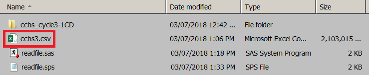
```

* **Step 13**: If you want to save the file in SAS format, you can do so by writing the following sas code into the 'Editor' window. Here we are saving the data Hs within the Work library in to a data called cchs3 within the SASLib library. Note that, the directory name has to be where you want to save the output file. 
```{r eval=FALSE}
LIBNAME SASLib "C:\CCHS\Data";
DATA SASLib.cchs3;
    set Work.Hs;
run;
```
Submit these codes into SAS:

```{r ubc26, echo=FALSE, out.width = '65%'}
knitr::include_graphics("images/abacus26.png")
```

* **Step 13**: go to that directory to see the file cchs3.sas7dbat

```{r ubc27, echo=FALSE, out.width = '65%'}
knitr::include_graphics("images/abacus27.png")
```

### Option 2: Processing data using PSPP (Free)
PSPP is a free package; alternative to commercial software SPSS. We can use the same SPSS codes to read the datafile into PSPP, and save.

* **Step 1**: Get the free PSPP software from the website: [www.gnu.org/software/pspp/](http://www.gnu.org/software/pspp/)

```{r ubc30, echo=FALSE, out.width = '65%'}
knitr::include_graphics("images/abacus30.png")
```

* **Step 2**: Open PSPP

```{r ubc31, echo=FALSE, out.width = '65%'}
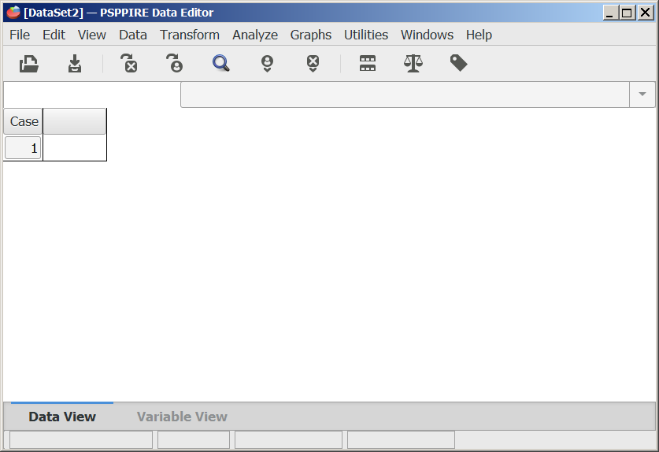
```

* **Step 3**: Go to 'file' menu and click 'open'

```{r ubc32, echo=FALSE, out.width = '65%'}
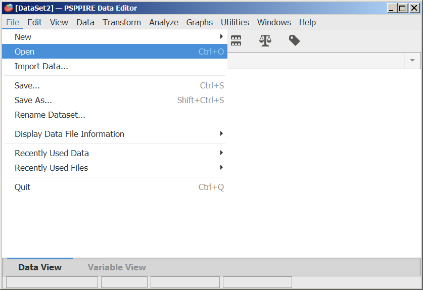
```

* **Step 4**: Specify the *readfile.sps* file from the 'SAS_SPSS' folder.

```{r ubc33, echo=FALSE, out.width = '65%'}
knitr::include_graphics("images/abacus33.png")
```

* **Step 5**: Similar to before, change the directories as appropriate. Get rid of the extra lines of codes. Resulting codes are as follows:
```{r eval=FALSE}
file handle infile/name = 'C:\CCHS\Data\cchs_cycle3-1CD\DATA\hs.txt'.
data list file = infile notable/.
include file = "C:\CCHS\Data\cchs_cycle3-1CD\SAS_SPSS\Layouts\hs\hs_i.sps".
include file = "C:\CCHS\Data\cchs_cycle3-1CD\SAS_SPSS\Layouts\hs\hsvale.sps".
include file = "C:\CCHS\Data\cchs_cycle3-1CD\SAS_SPSS\Layouts\hs\hsvare.sps".
include file = "C:\CCHS\Data\cchs_cycle3-1CD\SAS_SPSS\Layouts\hs\hsmiss.sps".
execute.
```

```{r ubc34, echo=FALSE, out.width = '65%'}
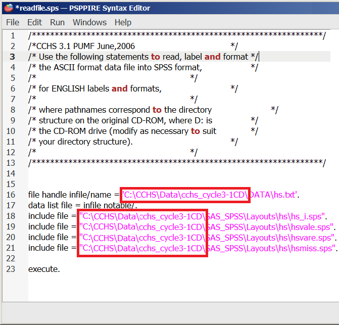
```

* **Step 6**: Run the codes.

```{r ubc35, echo=FALSE, out.width = '65%'}
knitr::include_graphics("images/abacus35.png")
```

* **Step 7**: This is a large data, and will take some time to load the data into the PSPP data editor. Be patient. Once loading is complete, it will show the 'data view'.

```{r ubc36, echo=FALSE, out.width = '65%'}
knitr::include_graphics("images/abacus36.png")
```

* **Step 7**: You can also check the 'variable view'.

```{r ubc37, echo=FALSE, out.width = '65%'}

```

* **Step 8**: Save the data by clicking 'File' and then 'save as ...'

```{r ubc38, echo=FALSE, out.width = '65%'}
knitr::include_graphics("images/abacus38.png")
```

* **Step 9**: Specify the name of the datafile and the location / folder to save the data file.

```{r ubc39, echo=FALSE, out.width = '65%'}
knitr::include_graphics("images/abacus39.png")
```

* **Step 10**: See the SAV file saved in the directory.

```{r ubc40, echo=FALSE, out.width = '65%'}
knitr::include_graphics("images/abacus40.png")
```

* **Step 11**: To save CSV format data, use the following syntax. 
```{r eval=FALSE}
SAVE TRANSLATE
  /OUTFILE="C:/CCHS/Data/cchs3b.csv"  
  /TYPE=CSV
  /FIELDNAMES      
  /CELLS=VALUES.
```
Note that, for categorical data, you can either save values or labels. For our purpose, we prefer values, and hence saved with values here.

```{r ubc41, echo=FALSE, out.width = '65%'}
knitr::include_graphics("images/abacus41.png")
```

* **Step 12**: See the CSV file saved in the directory extracted from PSPP.

```{r ubc42, echo=FALSE, out.width = '65%'}
knitr::include_graphics("images/abacus42.png")
```

## Processing data in R

### Download software

* **Step 1**: Download either 'R' from CRAN [www.r-project.org](https://www.r-project.org/) or 'R open' from Microsoft [mran.microsoft.com/open](https://mran.microsoft.com/open)

```{r R03, echo=FALSE, out.width = '65%'}
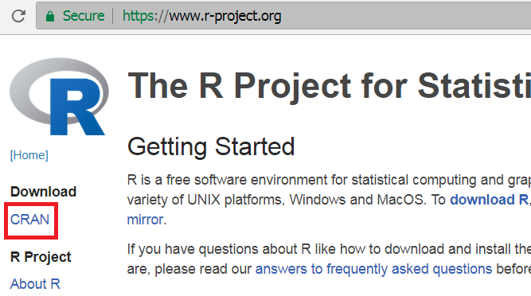
```

```{r R01, echo=FALSE, out.width = '65%'}
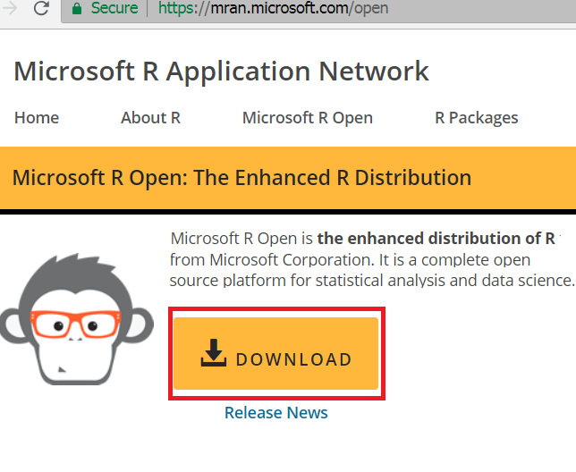
```

* **Step 2**: Download RStudio from [www.rstudio.com/](https://www.rstudio.com/)

```{r R02, echo=FALSE, out.width = '65%'}
knitr::include_graphics("images/R02.png")
```

* **Step 3**: Open RStudio 

```{r R04, echo=FALSE, out.width = '65%'}
knitr::include_graphics("images/R04.png")
```

### Import, export and load data into R

* **Step 1**: Set working directory

```{r eval=FALSE}
setwd("C:/CCHS/Data/") # or something appropriate
```

* **Step 2**: Read the dataset created from PSPP with cell values. We can also do a small check to see if the cell values are visible. For example, we choose a variable 'CCCE_05A', and tabulate it.

```{r eval=FALSE}
Hs <- read.csv("cchs3b.csv", header = TRUE)
table(Hs$CCCE_05A)
```

```{r ubc46, echo=FALSE, out.width = '65%'}
knitr::include_graphics("images/abacus46.png")
```

* **Step 3**: Save the RData file from R into a folder `SurveyData`:

```{r eval=FALSE}
save(Hs, file = "SurveyData/cchs3.RData")
```

* **Step 4**: See the RData file saved in the directory extracted from R.

```{r ubc43, echo=FALSE, out.width = '65%'}
knitr::include_graphics("images/abacus43.png")
```

* **Step 5**: Close R / RStudio and restart it. Environment window within RStudio should be empty.

```{r ubc44, echo=FALSE, out.width = '65%'}
knitr::include_graphics("images/abacus44.png")
```

* **Step 6**: Load the saved RData into R. Environment window within RStudio should have 'Hs' dataset.

```{r eval=FALSE}
load("SurveyData/cchs3.RData")
```

```{r ubc45, echo=FALSE, out.width = '65%'}
knitr::include_graphics("images/abacus45.png")
```


<!--chapter:end:importCCHS.Rmd-->

# Importing NHANES to R

This is a short instruction document of how to get NHANES dataset from the US CDC site to your RStudio environment. Once we bring the dataset into RStudio, the next step is to think about creating analytic dataset.

```{r setup5, include=FALSE}
require(SASxport)
use.saved.chche <- TRUE
```

## NHANES Dataset

National Center for Health Statistics (NCHS) conducts National Health and Nutrition Examination Survey (NHANES) (@nhanes). These surveys are designed to evaluate the health and nutritional status of U.S. adults and children. These surveys are being administered in two-year cycles or intervals starting from 1999-2000. Prior to 1999, a number of surveys were conducted (e.g., NHANES III), but in our discussion, we will mostly restrict our discussions to `continuous NHANES' (e.g., NHANES 1999-2000 to NHANES 2017-2018).

Witin the CDC website, continuous NHANES data are available in 5 categories:

    - Demographics
    - Dietary
    - Examination
    - Laboratory
    - Questionnaire

## Accessing NHANES Data

In the following example, we will see how to download 'Demographics' data, and check associated variable in that data.

### Accessing NHANES Data Directly from the CDC website

NHANES 1999-2000 and onward survey datasets are publicly available at [wwwn.cdc.gov/nchs/nhanes/](https://wwwn.cdc.gov/nchs/nhanes/).

```{r cdc1, echo=FALSE, out.width = '65%'}
knitr::include_graphics("images/n15.png")
```

* **Step 1**: Say, for example, we are interested about NHANES 2015-2016 surveys. Clicking the associated link in the above Figure gets us to the page for the cirresponding cycle (see below).  

```{r cdc2, echo=FALSE, out.width = '65%'}
knitr::include_graphics("images/n15demo.png")
```

* **Step 2**: There are various types of data available for this survey. Let's explore the demographic information from this clycle. These data are mostly available in the form of SAS `XPT' format (see below).

```{r cdc3, echo=FALSE, out.width = '65%'}
knitr::include_graphics("images/xptsasdata.png")
```

* **Step 3**: We can download the XPT data in the local PC folder and read the data into R as as follows:

```{r load, echo=TRUE, eval=FALSE}
# install.packages("SASxport")
require(SASxport)
library(foreign)
DEMO <- read.xport("SurveyData\\DEMO_I.XPT")
```

```{r loadMirror, echo=FALSE, eval=TRUE}
require(SASxport)
library(foreign)
DEMO <- read.xport("SurveyData/DEMO_I.XPT")
```

* **Step 4**: Once data is imported in RStudio, we will see the ```DEMO``` object listed under data window (see below):

```{r cdc4, echo=FALSE, out.width = '65%'}
knitr::include_graphics("images/rdata.png")
```

* **Step 5**: We can also check the variable names in this ```DEMO``` dataset as follows:

```{r cdc5, echo=TRUE}
names(DEMO)
```

* **Step 6**: We can open the data in RStudio in the dataview window (by clicking the ```DEMO``` data from the data window). The next Figure shows only a few columns and rows from this large dataset. Note that there are some values marked as "NA", which represents missing values.

```{r cdc6, echo=FALSE, out.width = '65%'}
knitr::include_graphics("images/dataview.png")
```

* **Step 7**: There is a column name associated with each column, e.g., ```DMDHSEDU``` in the first column in the above Figure. To understand what the column names mean in this Figure, we need to take a look at the codebook. To access codebook, click the ```'DEMO|Doc'``` link (in step 2). This will show the data documentation and associated codebook (see the next Figure). 

```{r cdc7, echo=FALSE, out.width = '65%'}
knitr::include_graphics("images/toc.png")
```

* **Step 8**: We can see a link for the column or variable ```DMDHSEDU``` in the table of content (in the above Figure). Clicking that link will provide us further information about what this variable means (see the next Figure).

```{r cdc8, echo=FALSE, out.width = '65%'}
knitr::include_graphics("images/DMDHSEDU.png")
```

* **Step 9**: We can assess if the numbers reported under count and cumulative (from the above Figure) matches with what we get from the ```DEMO``` data we just imported (particularly, for the ```DMDHSEDU``` variable):

```{r cdc9, echo=TRUE}
table(DEMO$DMDHSEDU)
cumsum(table(DEMO$DMDHSEDU))
length(is.na(DEMO$DMDHSEDU))
```

### Accessing NHANES Data Using R Packages

#### nhanesA

```nhanesA``` provides a convenient way to download and analyze NHANES survey data. 

```{r load1, echo=TRUE, eval=FALSE}
#install.packages("nhanesA")
library(nhanesA)
```

* **Step 1**: Witin the CDC website, NHANES data are available in 5 categories
    - Demographics (`DEMO`)
    - Dietary (`DIET`)
    - Examination (`EXAM`)
    - Laboratory (`LAB`)
    - Questionnaire (`Q`)

To get a list of available variables within a datafile, we run the following command (e.g., we check variable names within ```DEMO``` data):

```{r search, eval=TRUE, cache=use.saved.chche}
library(nhanesA)
nhanesTables(data_group='DEMO', year=2015)
```
* **Step 2**: We can obtain the summaries of the downloaded data as follows (see below):

```{r search3, eval=TRUE, cache=use.saved.chche}
demo <- nhanes('DEMO_I')
names(demo)
table(demo$DMDHSEDU)
cumsum(table(demo$DMDHSEDU))
length(is.na(demo$DMDHSEDU))
```

#### RNHANES
```RNHANES``` (@RNHANES) is another packages for downloading the NHANES data easily. Try yourself.


<!--chapter:end:importNHANES.Rmd-->

`r if (knitr:::is_html_output()) '
# References {-}
'`

<!--chapter:end:references.Rmd-->

