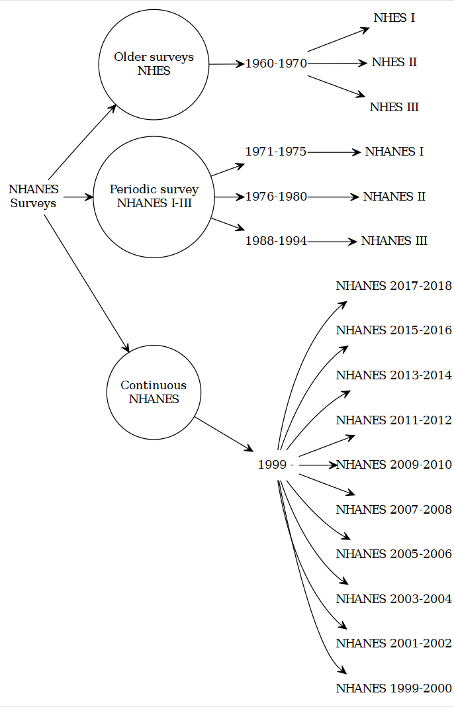

```{r setupi, include=FALSE}
knitr::opts_chunk$set(echo = TRUE)
require(DiagrammeR)
require(DiagrammeRsvg)
require(rsvg)
library(magrittr)
library(svglite)
library(png)
use.saved.chche <- TRUE
```

# NHANES: an introduction 

## Overview

National Center for Health Statistics (NCHS) has been conducting surveys combining interviews with health/laboratory and physical examination studies since 1959. The end-product, recently known as, National Health and Nutrition Examination Surveys (NHANES) provide cross-sectional data of the health and nutrition of the United States population. This information source has been central to formulating nationwide public health policies and practices.

## Survey history

Overall NHANES survey history
```{r graph0i, echo=FALSE, cache=use.saved.chche}
g1 <- grViz("
	digraph causal {
	
	  # Nodes
    node [shape = circle]
    O0 [label = 'Older surveys\n NHES']
    M0 [label = 'Periodic survey\n NHANES I-III']
    N [label = 'Continuous\n NHANES']
    
	  node [shape = plaintext]
    # node [shape = circle]
    S [label = 'NHANES\n Surveys']
	  O [label = '1960-1970']
	  o1 [label = 'NHES I']
	  o2 [label = 'NHES II']
	  o3 [label = 'NHES III']
    M [label = '1971-1975']
    m [label = 'NHANES I']
    M1 [label = '1976-1980']
    m1 [label = 'NHANES II']
    M2 [label = '1988-1994']
    m2 [label = 'NHANES III']
    n [label = '1999 - ']
    n10 [label = 'NHANES 2017-2018']
    n9 [label = 'NHANES 2015-2016']
    n8 [label = 'NHANES 2013-2014']
    n7 [label = 'NHANES 2011-2012']
    n6 [label = 'NHANES 2009-2010']
    n5 [label = 'NHANES 2007-2008']
    n4 [label = 'NHANES 2005-2006']
    n3 [label = 'NHANES 2003-2004']
    n2 [label = 'NHANES 2001-2002']
    n1 [label = 'NHANES 1999-2000']
	  
	  # Edges
	  edge [color = black,
	        arrowhead = vee]
	  rankdir = LR
    S -> {O0 M0 N}
    O0 -> O
    M0 -> {M M1 M2}
	  O-> {o1 o2 o3}
    M -> m
    M1 -> m1
    M2 -> m2
    N -> n
    n -> {n1 n2 n3 n4 n5 n6 n7 n8 n9 n10}
	  
	  # Graph
	  graph [overlap = true, fontsize = 10]
	}")
g1 %>% export_svg %>% charToRaw %>% rsvg %>% png::writePNG("images/g1.png")
```

```{r graph0xi, echo=FALSE, out.width = '65%'}

```

## NHANES datafile and documents

### File format
The Continuous NHANES files are stored in the NHANES website as SAS transport file formats (.xpt).  You can import this data in any statistical package that supports this file format.

### Continuous NHANES Components

Continuous NHANES [components](https://www.cdc.gov/nchs/tutorials/NHANES/SurveyOrientation/DataStructureContents/Info1.htm) separated to reduce the amount of time to download and documentation size:
```{r graph1i, echo=FALSE, cache=use.saved.chche}
g2 <- grViz("
	digraph causal {
	
	  # Nodes
    node [shape = box]
    # node [shape = circle]
    d [label = 'Demographics']
    i [label = 'Dietary']
    e [label = 'Examination'] 
    l [label = 'Laboratory']
    q [label = 'Questionnaire']

    node [shape = plaintext]
    N [label = 'Continuous NHANES\n cycles data\n collection']
    d1 [label = 'Survey design']
    d2 [label = 'demographic\n variables']
    i1 [label = 'foods']
    i2 [label = 'beverages']
    i3 [label = 'dietary\n supplements']
    e1 [label = 'physical exams*']
    e2 [label = 'dental exams']
    #e3 [label = 'dietary interview']
    l1 [label = 'blood']
    l2 [label = 'urine']
    l3 [label = 'hair']
    l4 [label = 'air']
    l5 [label = 'tuberculosis\n skin test']
    l6 [label = 'household\n dust and\n water\n specimens']
    q1 [label = 'household\n interview']
    q2 [label = 'mobile\n examination\n center (MEC)\n interview']
    d11 [label = 'weights']
    d12 [label = 'design\n strata']
    d13 [label = 'primary\n sampling\n units']
	  
	  # Edges
	  edge [color = black,
	        arrowhead = vee]
	  rankdir = LR
    N -> {d i e l q}
    d -> {d1 d2}
    i -> {i1 i2 i3}
    e -> {e1 e2}
    l -> {l1 l2 l3 l4 l5 l6}
    q -> {q1 q2}
    d1 -> {d11 d12 d13}

	  # Graph
	  graph [overlap = true, fontsize = 10]
	}")
g2 %>% export_svg %>% charToRaw %>% rsvg %>% png::writePNG("images/g2.png")
```

```{r graph1xi, echo=FALSE, out.width = '65%'}
knitr::include_graphics("images/g2.png")
```

### Public release excludes
The following data have not been released on the NHANES website as public release files due to confidentiality concerns:

* adolescent data on alcohol use, 
* smoking, 
* sexual behavior, 
* reproductive health and drug use

### Combining data  

#### Different cycles

It is possible to combine datasets from different years/cycles together in NHANES. However, NHANES is a cross-sectional data, and identification of the same person accross different cycles is not possible in the public resease datasets. For appending data from different cycles, please make sure that the variable names/labels are the same/identical in years under consideration (in some years, names and labels do change).

#### Within the same cycle
Within NHANES datasets in a given cycle, each sampled person has an unique identifier sequence number (variable `SEQN`) and therefore various data components: 

* demographics, 
* dietary,
* examination, 
* laboratory and 
* questionnaire 

within same cycle can be merged.

### Missing data and outliers

@CDCfaq recommends: 

> 1. "As a general rule, if 10% or less of your data for a variable are missing from your analytic dataset, it is usually acceptable to continue your analysis without further evaluation or adjustment. However, if more than 10% of the data for a variable are missing, you may need to determine whether the missing values are distributed equally across socio-demographic characteristics, and decide  whether further imputation of missing values or use of adjusted weights are necessary."

> 2. "If you fail to identify 'refusal' or 'do not know' as types of missing data, and treat the assigned values for 'refused' or 'do not know' as real values, you will get distorted results in your statistical analyses. Therefore, it is important to recode 'refused' or 'don't know' responses as missing values (either as a period (.) for numeric variables or as a blank for character variables)."

> 3. "Outliers with extremely large weights could have an influential impact on your estimates. You will have to decide whether to keep these influential outliers in your analysis or not. It is up to the analysts to make that decision."

### NHANES documents

```{r graph2i, echo=FALSE,cache=use.saved.chche}
g3 <- grViz("
	digraph causal {
	
	  # Nodes
	  node [shape = plaintext]
    # node [shape = circle]
    N [label = 'Continuous NHANES cycles']
    c [label = 'codebook']
    d [label = 'data file\n documentation'] 
    f [label = 'frequency tables']
	  
	  # Edges
	  edge [color = black,
	        arrowhead = vee]
	  rankdir = LR
    N -> {c d f}

	  # Graph
	  graph [overlap = true, fontsize = 10]
	}")
g3 %>% export_svg %>% charToRaw %>% rsvg %>% png::writePNG("images/g3.png")
```

```{r graph2xi, echo=FALSE, out.width = '65%'}

```

## Exercise (web)

- More information about [NHANES design](https://wwwn.cdc.gov/nchs/nhanes/tutorials/module2.aspx)
- Visit [US CDC](https://wwwn.cdc.gov/Nchs/Nhanes/search/) and do a variable keyword search based on your research interest (e.g., arthritis).
