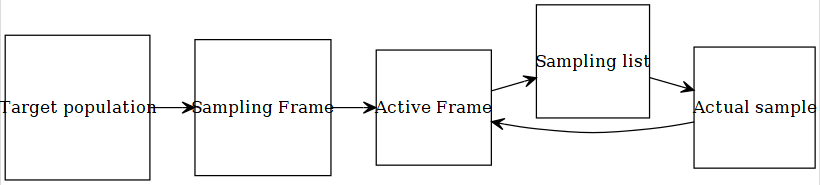
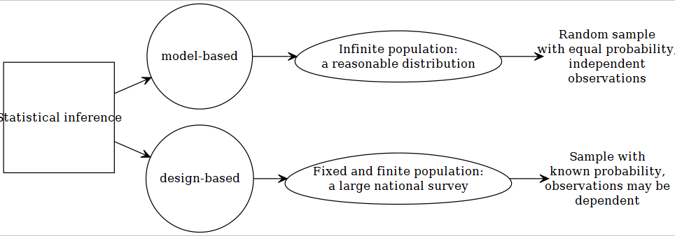

# Design-based Approach

```{r setup4, include=FALSE}
#require(diagram)
require(DiagrammeR)
require(DiagrammeRsvg)
require(rsvg)
library(magrittr)
library(svglite)
library(png)
use.saved.chche <- TRUE
```


```{r graph1, echo=FALSE, include = FALSE}
# names <- c("Statistical inference", "Design-based", "Model-based")
# M <- matrix(nrow = 3, ncol = 3, byrow = TRUE, data = 0)
# M[2, 1] <- M[3, 1] <- ""
# plotmat(M, pos = c(1, 2), curve = 0, name = names, lwd = 1,
#         box.lwd = 2, cex.txt = 0.8, box.type = "square", box.prop = 1.0)
```

Before discussing design-based approach, let us review some of concepts related to `sampling`. 

## Sampling

### Steps of generalization

```{r sampling0, echo=FALSE,cache=use.saved.chche}
sampling0 <- grViz("
	digraph causal {
	
	  # Nodes
	  node [shape = square]
    t [label = 'Target population']
    s [label = 'Sampling Frame']
    g [label = 'Active Frame']
    m [label = 'Sampling list']
    r [label = 'Actual sample']

	  # Edges
	  edge [color = black,
	        arrowhead = vee]
	  rankdir = LR
    t -> s -> g  -> m -> r
    r -> g
	  # Graph
	  graph [overlap = true, fontsize = 10]
	}")
sampling0 %>% export_svg %>% charToRaw %>% rsvg %>% png::writePNG("images/sampling0.png")
```

```{r sampling0x, echo=FALSE, out.width = '65%'}

```

Example: Let us consider CCHS.

- Target population
    - Canadian population 12 years of age and over
- Sampling Frame
    - Canadian population 12 years of age and over exluding about 3% population (e.g., aboriginal settlements, canadian Forces, institutionalized, foster care, 2 selected Quebec health regions)
- Active Frame
    - People that are still reachable e.g., not dead or have not moved
- Sampling list
    - Prepared from a specific sampling technique
- Actual sample
    - people that have responded

Note that, results from 'actual sample' can be generalized to the 'active frame'. Hence, an inference from a sample in not really generalizable to the target population (strictly speaking).


### Types of sampling techniques

```{r sampling1, echo=FALSE,cache=use.saved.chche}
sampling1 <- grViz("
	digraph causal {
	
	  # Nodes
	  node [shape = square]
    s [label = 'sampling']
    
    node [shape = circle]
    p [label = 'Probability,\n known non-zero\n probability of selection']
    n [label = 'Non-probability, \n probabilities of\n selection are\n not known'] 
	  
    node [shape = egg]
    srs [label = 'simple random,\n equal selection probability']
    str [label = 'stratified,\n population divided\n into heterogeneous\n groups']
    cluster [label = 'cluster,\n population divided\n into comparable\n groups']
    others [label = '(systematic) ...']
    complex [label = 'Complex survey, \n cluster + stratification']
    conv [label = 'convenience,\n  easy\n access']
    pur [label = 'purposive,\n  rare\n disease']
    quo [label = 'quota,\n  interviewers\n choose']
    other [label = '...']

	  # Edges
	  edge [color = black,
	        arrowhead = vee]
	  rankdir = LR
    s -> {p n}
    p -> {srs str cluster complex others} 
    n -> {conv pur quo other}

	  # Graph
	  graph [overlap = true, fontsize = 10]
	}")
sampling1 %>% export_svg %>% charToRaw %>% rsvg %>% png::writePNG("images/sampling1.png")
```

```{r sampling1x, echo=FALSE, out.width = '85%'}
knitr::include_graphics("images/sampling1.png")
```


## Statistical inference

### Model-based  
Most of the statistical techniques we have seen in our pre-requisite courses (`SPPH 400, 500`) generally assumed that we are dealing with a sample that was obtained from an infinite population. We usually assume that a random process can approximate such data generation process, and the data was collected by a simple random sampling or SRS (everyone has equal opportunity to be selected in the sample). All our conclusions are based on such assumptions. If we are wrong in specifying correct distribution to approximate the data generating process, our subsequent inferences may not be valid anymore. 

```{r graph2, echo=FALSE,cache=use.saved.chche}
design1 <- grViz("
	digraph causal {
	
	  # Nodes
	  node [shape = square]
    s [label = 'Statistical inference']
    
    node [shape = circle]
    m [label = 'model-based']
    d [label = 'design-based'] 
	  
    node [shape = egg]
    i [label = 'Infinite population:\n a reasonable distribution']
    f [label = 'Fixed and finite population:\n a large national survey']

    node [shape = plaintext]
    is [label = 'Random sample\n with equal probability,\n independent\n observations']
    if [label = 'Sample with\n known probability,\n observations may be\n dependent']

	  # Edges
	  edge [color = black,
	        arrowhead = vee]
	  rankdir = LR
    s -> {m d}
    m -> i 
    d -> f
    i -> is
    f -> if

	  # Graph
	  graph [overlap = true, fontsize = 10]
	}")
design1 %>% export_svg %>% charToRaw %>% rsvg %>% png::writePNG("images/design1.png")
```

```{r graph2x, echo=FALSE, out.width = '85%'}

```

### Design-based 

Generally, when wide-scale surveys are designed, simple random sampling or SRS may not be feasible for various practical considerations. May be researchers and policy-makers want that a special but small sub-group subjects should be included in our sample (e.g., people suffering from a rare disease), but it is possible that by a SRS scheme, none of the subject from that small subgroup will be included. For convenience of sampling, and for controlling variance, researchers may have to make desicions regarding how the survey needs to collect sample. Researchers may resort to cluster or stratified sampling; or a mix of both (trade-off between cost and precision). Unfortunately, in these cases, equal probability of being selected in the sample is not there any more. @lumley2011complex discussed the following properties for making design-based inference:

- properties needed to get valid estimates
    - non-zero probability ($P_i>0$ for subject i) of being selected in the sample
    - every subject has a known probability ($P_i$) of being seleted
- properties needed to acieve accuracy of those estimates
    - Every pair of subjects must have a non-zero probability ($P_{ij}>0$ for subjects i and j) of being selected in the sample and
    - that probability ($P_{ij}$) must be known as well.
    
## Complex surveys

### Design features    

```{r graph3, echo=FALSE,cache=use.saved.chche}
design2 <- grViz("
	digraph causal {
	
	  # Nodes
	  node [shape = egg]
    cs [label = 'Complex surveys']
    
    node [shape = circle]
    c [label = 'Clustering']
    s [label = 'Stratification'] 
    w [label = 'Weighting'] 
	  
	  # Edges
	  edge [color = black,
	        arrowhead = vee]
	  rankdir = LR
    cs -> {c s w}

	  # Graph
	  graph [overlap = true, fontsize = 10]
	}")
design2 %>% export_svg %>% charToRaw %>% rsvg %>% png::writePNG("images/design2.png")
```

```{r graph3x, echo=FALSE, out.width = '45%'}
knitr::include_graphics("images/design2.png")
```

#### Stratification

Considering sub-groups that are sufficiently different from each other with respect to characteristics. Usual examples:

- different geographical location
- income
- gender

For each stratum (single unit), sampling is done separately. As we can select sample size from each stratum, we are able to control for variability of the estimates (`SE`) from each strata as well.

#### Clustering

Clustering is done for convenience of data collection, generally. In a nationwide survey, researchers may choose to collect more samples from selected geographic locations. This is generally the case for cost considerations. In doing so, the surveyers don't have to travel too far, as they could essentially get many neighboring subjects at a much lower cost. An obvious consequence could be that the neighboring subjects may be more correlated with each other compared to subjects who are selected by randomness. This may cause the observations not being independent anymore.

#### Weighting

Assume that, in a SRS, a subject is selected in a sample with a probability of $p_i = 0.04$. This mean, that person is representing $(1/p_i) = (1/0.04) = 25$ subjects in the population. We call this the `sampling weight` ($w_i = 25$). There are other type of weight:

- `precision weight`
- `frequency weight`

but we are not really interested about those in this course in general.

In a complex survey, where we have stratification and clustering, this weight is not as straight-forward becasue, then, it is coming from an unequal probability sampling. As a consequence, not all subjects in the population will have the same probability $(p_i)$ of being included in the sample, and the sampling weights ($w_i$) will vary as well (but the probability or weight is known for each subjects).

### Design effect

Compared to a SRS, all of the design features of a complex survey, such as, stratification, cluster sampling, and weighting generally influence the SEs of the estimates. Survey researchers use a ratio called design effect, to account for the difference in SEs between a complex survey versus a SRS:

$DE^2 = \frac{SE^2_{Complex.Survey}}{SE^2_{SRS}}$.

## Further readings

Available via UBC library:

- Chapter 2 of @heeringa2017applied
- Chapter 1 of @lumley2011complex
- Section 6.3 of @bilder2014analysis
- Chapter 12 of @vittinghoff2011regression

## Exercise

- Skim through the first chapter (from the further readings list). Should be easier to read most of it after this lecture.
- If any terminology remains unfamiliar, please discuss on Canvas.


