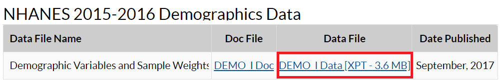

# Importing NHANES to R

This is a short instruction document of how to get NHANES dataset from the US CDC site to your RStudio environment. Once we bring the dataset into RStudio, the next step is to think about creating analytic dataset.

```{r setup5, include=FALSE}
require(SASxport)
use.saved.chche <- TRUE
```

## NHANES Dataset

National Center for Health Statistics (NCHS) conducts National Health and Nutrition Examination Survey (NHANES) (@nhanes). These surveys are designed to evaluate the health and nutritional status of U.S. adults and children. These surveys are being administered in two-year cycles or intervals starting from 1999-2000. Prior to 1999, a number of surveys were conducted (e.g., NHANES III), but in our discussion, we will mostly restrict our discussions to `continuous NHANES' (e.g., NHANES 1999-2000 to NHANES 2017-2018).

Witin the CDC website, continuous NHANES data are available in 5 categories:

    - Demographics
    - Dietary
    - Examination
    - Laboratory
    - Questionnaire

## Accessing NHANES Data

In the following example, we will see how to download 'Demographics' data, and check associated variable in that data.

### Accessing NHANES Data Directly from the CDC website

NHANES 1999-2000 and onward survey datasets are publicly available at [wwwn.cdc.gov/nchs/nhanes/](https://wwwn.cdc.gov/nchs/nhanes/).

```{r cdc1, echo=FALSE, out.width = '65%'}
knitr::include_graphics("images/n15.png")
```

* **Step 1**: Say, for example, we are interested about NHANES 2015-2016 surveys. Clicking the associated link in the above Figure gets us to the page for the cirresponding cycle (see below).  

```{r cdc2, echo=FALSE, out.width = '65%'}
knitr::include_graphics("images/n15demo.png")
```

* **Step 2**: There are various types of data available for this survey. Let's explore the demographic information from this clycle. These data are mostly available in the form of SAS `XPT' format (see below).

```{r cdc3, echo=FALSE, out.width = '65%'}

```

* **Step 3**: We can download the XPT data in the local PC folder and read the data into R as as follows:

```{r load, echo=TRUE, eval=FALSE}
# install.packages("SASxport")
require(SASxport)
library(foreign)
DEMO <- read.xport("SurveyData\\DEMO_I.XPT")
```

```{r loadMirror, echo=FALSE, eval=TRUE}
require(SASxport)
library(foreign)
DEMO <- read.xport("SurveyData/DEMO_I.XPT")
```

* **Step 4**: Once data is imported in RStudio, we will see the ```DEMO``` object listed under data window (see below):

```{r cdc4, echo=FALSE, out.width = '65%'}
knitr::include_graphics("images/rdata.png")
```

* **Step 5**: We can also check the variable names in this ```DEMO``` dataset as follows:

```{r cdc5, echo=TRUE}
names(DEMO)
```

* **Step 6**: We can open the data in RStudio in the dataview window (by clicking the ```DEMO``` data from the data window). The next Figure shows only a few columns and rows from this large dataset. Note that there are some values marked as "NA", which represents missing values.

```{r cdc6, echo=FALSE, out.width = '65%'}
knitr::include_graphics("images/dataview.png")
```

* **Step 7**: There is a column name associated with each column, e.g., ```DMDHSEDU``` in the first column in the above Figure. To understand what the column names mean in this Figure, we need to take a look at the codebook. To access codebook, click the ```'DEMO|Doc'``` link (in step 2). This will show the data documentation and associated codebook (see the next Figure). 

```{r cdc7, echo=FALSE, out.width = '65%'}
knitr::include_graphics("images/toc.png")
```

* **Step 8**: We can see a link for the column or variable ```DMDHSEDU``` in the table of content (in the above Figure). Clicking that link will provide us further information about what this variable means (see the next Figure).

```{r cdc8, echo=FALSE, out.width = '65%'}
knitr::include_graphics("images/DMDHSEDU.png")
```

* **Step 9**: We can assess if the numbers reported under count and cumulative (from the above Figure) matches with what we get from the ```DEMO``` data we just imported (particularly, for the ```DMDHSEDU``` variable):

```{r cdc9, echo=TRUE}
table(DEMO$DMDHSEDU)
cumsum(table(DEMO$DMDHSEDU))
length(is.na(DEMO$DMDHSEDU))
```

### Accessing NHANES Data Using R Packages

#### nhanesA

```nhanesA``` provides a convenient way to download and analyze NHANES survey data. 

```{r load1, echo=TRUE, eval=FALSE}
#install.packages("nhanesA")
library(nhanesA)
```

* **Step 1**: Witin the CDC website, NHANES data are available in 5 categories
    - Demographics (`DEMO`)
    - Dietary (`DIET`)
    - Examination (`EXAM`)
    - Laboratory (`LAB`)
    - Questionnaire (`Q`)

To get a list of available variables within a datafile, we run the following command (e.g., we check variable names within ```DEMO``` data):

```{r search, eval=TRUE, cache=use.saved.chche}
library(nhanesA)
nhanesTables(data_group='DEMO', year=2015)
```
* **Step 2**: We can obtain the summaries of the downloaded data as follows (see below):

```{r search3, eval=TRUE, cache=use.saved.chche}
demo <- nhanes('DEMO_I')
names(demo)
table(demo$DMDHSEDU)
cumsum(table(demo$DMDHSEDU))
length(is.na(demo$DMDHSEDU))
```

#### RNHANES
```RNHANES``` (@RNHANES) is another packages for downloading the NHANES data easily. Try yourself.


